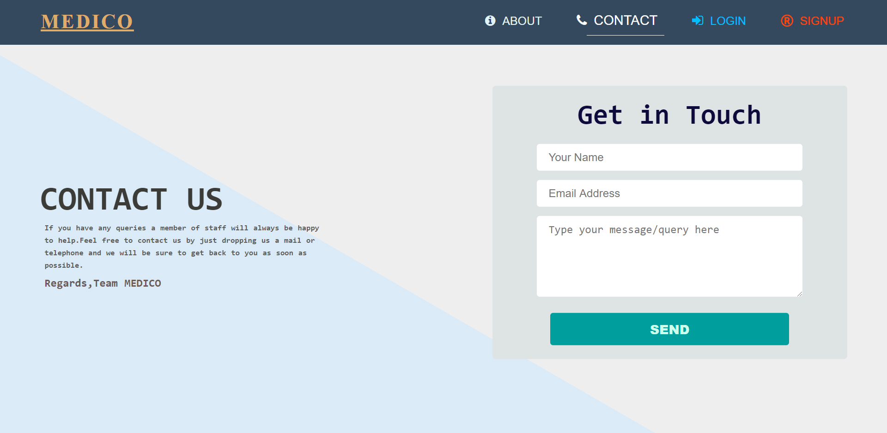

<h1> MySQL-Flask Project </h1> 

## Tech Stack 
* Flask
* MySQL

## Screenshots
### Login Page (Signup/Signin page is similar_)

### DashBoard Page

### Profile Page 

### Book Appointment Page 

### Received Email (_After booking appointment successfully_)

### Contact Us Page 

### Home Page 

### CONTRIBUTORS :
## - [Pratik Zinjurde](https://github.com/pratikpz18)
## - [Sahil Velhal](https://github.com/sahil-777)
## - [Amit Kumar Yadav](https://github.com/yadavamitk221)
